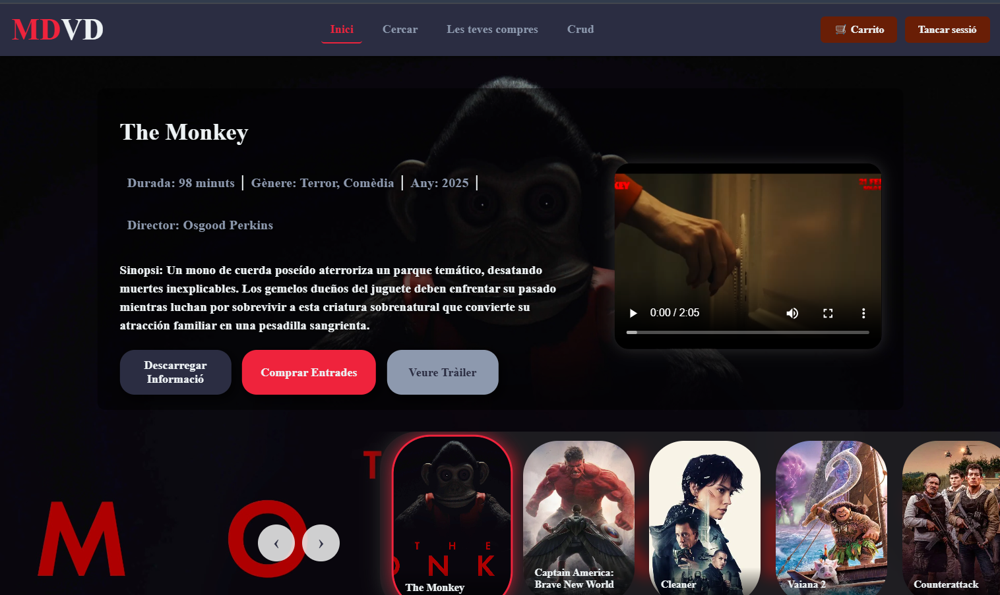

# 🎬 MDVD Cines - Gestión de Entradas de Cine



## 🔍 Información del Proyecto

| 📌 Detalle          | ℹ️ Información |
|--------------------|---------------|
| **Autora**         | Gursimranjit Kaur |
| **Estado**         | Completado ✅ |
| **URL Producción** | [http://mdvdcine.daw.inspedralbes.cat/] |
| **URL Prod  Back** | [http://mdvdback.daw.inspedralbes.cat/] |
| **Gestor Tareas**  | [tree.taiga.io/project/simrankaur-tr3-cinema-simran] |
| **Prototipo UI**   | [https://design.penpot.app/#/view?file-id=456eee66-5663-80cb-8005-d35604cdc330] |

## ✨ Características Principales

<div style="background: #f8f9fa; padding: 15px; border-radius: 10px; margin: 15px 0;">
  
🔍 **Búsqueda avanzada**  
Filtra películas por género, idioma o año con nuestro sistema inteligente

🛒 **Compra integrada**  
Sistema completo de reserva y compra de entradas con confirmación inmediata

📊 **Gestión de reservas**  
Consulta tu historial y gestiona tus próximas visitas al cine

👨‍💼 **Panel administrativo**  
Herramientas completas para la gestión del cine y programación

✉️ **Notificaciones**  
Recibe emails de confirmación con los detalles de tus compras

</div>

## 🛠 Stack Tecnológico

<div style="display: flex; justify-content: space-between; margin: 20px 0;">

<div style="width: 48%; background: #f0f8ff; padding: 15px; border-radius: 10px;">

### **Frontend**
- Nuxt.js (Vue 3)
- Axios (API calls)

</div>

<div style="width: 48%; background: #fff0f5; padding: 15px; border-radius: 10px;">

### **Backend**
- Laravel 10
- MySQL Database
- Laravel Mail

</div>

</div>

## 🚀 Instalación Local

### 📋 Requisitos previos
- Node.js v18+
- PHP 8.1+
- Composer
- MySQL 5.7+

### 🔧 Configuración Backend

```bash
# Clonar repositorio
git clone [URL_DEL_REPO]

# Acceder a directorio backend
cd back

# Instalar dependencias
composer install

# Configurar entorno
cp .env.example .env

# Generar clave de aplicación
php artisan key:generate

# Configurar base de datos (editar .env)
DB_DATABASE=mdvd_cines
DB_USERNAME=tu_usuario
DB_PASSWORD=tu_contraseña

# Ejecutar migraciones
php artisan migrate --seed

# Iniciar servidor
php artisan serve
```

#### 🔧 Configuración Frontend

```bash
# Acceder al directorio frontend
cd ../front

# Instalar dependencias
npm install
npm install normalize.css

# Configurar conexión API (editar nuxt.config.ts)
apiBase: "http://localhost:8000/api"

# Iniciar aplicación
npm run dev

```

#### 📄 LICENCIA
Este proyecto está bajo la licencia MIT. Ver LICENSE para más detalles.

<div align="center"> ✨ Desarrollado por <b>Gursimranjit Kaur</b> ✨ </div> ```

Características destacadas:
Diseño profesional con badges de tecnologías

Estructura clara y bien organizada

Código formateado para fácil copiado

Responsive (se ve bien en cualquier dispositivo)

Enlaces clickables a todas las herramientas

Estilo moderno 

Secciones diferenciadas visualmente
